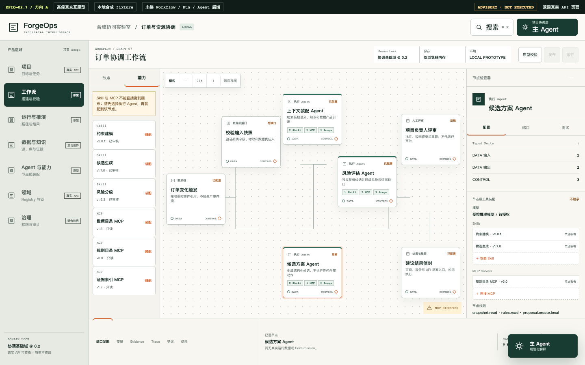

# ForgeOps Platform

> **本体驱动的领域智能体构建、编排、推演、评测与持续进化平台。**

ForgeOps 是一个仍在探索中的平台构想：把领域本体、企业知识、数据、Agent、模型、Skill、MCP、算法和仿真能力装配到同一套可追溯的工作流中，让普通工程师与领域专家也能构建、推演和评估自己的智能体系统。

它不把大模型当作可以绕过业务规则的万能主脑，也不认为可控工作流和自主 Agent 必须二选一。ForgeOps 尝试建立一种中间形态：**确定的部分由契约、节点、权限和运行时控制；不确定的部分交给有边界的 Agent；最后结果保留证据、版本和人工决定。**



> 上图是 EPIC-02.7 的高保真产品原型，不是真实 Workflow/Run/Agent Runtime。当前仓库不会伪装尚未实现的能力。

> **当前状态：** 项目于 2026-08-02 由产品负责人暂停并封存，状态为 `PAUSED_ARCHIVED_BY_PRODUCT_OWNER`。标签为 `forgeops-archive-2026-08-02-epic-02.7-partial`；EPIC-02.7 已形成原型但未最终验收，EPIC-03 未开始。暂停的原因是生产级建设所需的跨专业能力与长期投入超出个人现阶段可稳定承担的范围，而不是已经证明这条理论没有价值。详见[项目封存记录](docs/archive/PROJECT-ARCHIVE-2026-08-02.md)。

## 一句话理解 ForgeOps

ForgeOps 想做的不是“给大模型塞一堆公司文档”，而是：

> **先把一个行业和一家企业的业务知识整理成机器能理解、能版本管理的本体，再把数据、Agent、算法、Skill、MCP 和仿真工具围绕这套本体组装成业务工作流。**

可以把 ForgeOps 理解成一座“智能体系统装配工厂”：

| ForgeOps 概念 | 大白话解释 |
| --- | --- |
| 行业本体 | 这个行业有哪些对象、关系、规则和共同语言 |
| 企业 Overlay | 这家公司自己的编码、术语、SOP、规则和私有知识 |
| 数据产品 | ERP、MES、数据库等数据经过治理后的可用版本 |
| Agent | 参与业务分析和协作的不同角色 |
| Skill / MCP | Agent 可以使用的工具和外部系统接口 |
| 算法 / Solver | 处理确定性计算和优化问题 |
| 仿真 | 在真正采用方案前先测试可能结果 |
| 工作流 | 规定这些角色和工具如何协同 |
| Evidence | 记录每个结论使用了什么数据、知识和版本 |
| 人工评审 | 最终决定建议是否值得采用 |

## 一个企业如何通过 ForgeOps 落地本体

下面描述的是 ForgeOps 的**目标落地流程**，不是当前仓库已经全部实现的功能。


### 第一步：定义行业共同语言

行业专家先回答：

- 这个行业里有哪些核心对象；
- 它们之间有什么关系；
- 哪些规则必须遵守；
- 哪些指标用于判断结果好坏；
- 哪些知识来自标准、制度、SOP 或历史经验。

这些内容被整理成一个 **Domain Package（行业领域包）**。

例如钢帘线领域包可以描述产品、原料、工序、工艺路线、设备能力、订单、换型、维护窗口、在制品和交期风险之间的关系。它只保存行业可复用的共同知识，不保存某家企业的私有数据。

### 第二步：企业安装领域包并进行定制

同一个行业里的不同企业，编码和业务规则并不完全相同。

企业通过 **Organization Overlay（企业覆盖层）** 补充：

- 自己的产品编码和设备编号；
- 企业内部术语；
- 班次、日历和组织结构；
- 私有工艺规则和例外；
- 企业 SOP、制度和历史案例；
- ERP、MES、APS 中的字段映射。

例如：

```text
行业概念：设备        -> 企业系统字段：machine_code
行业概念：产品规格    -> 企业系统字段：material_spec
行业概念：维护窗口    -> 企业系统字段：maintenance_calendar
```

这样既能复用行业知识，又不会把企业私有内容写进公共领域包。

### 第三步：接入并治理企业数据

ForgeOps 不会把 ERP、MES 或数据库的数据直接扔给大模型。

```text
ERP 订单
MES 设备与在制品
APS 当前计划
WMS 库存
质量系统检验结果
        ↓
字段映射与权限校验
        ↓
完整性、新鲜度、单位和关联关系检查
        ↓
形成带版本的数据快照
```

每次运行都需要记录使用了哪个时间点的数据、数据来自哪个系统、质量是否合格、使用者是否有权限，以及后续能否重放同一次分析。

### 第四步：为业务场景装配 Agent 和工具

以排产场景为例，企业可以建立不同角色：

| Agent | 负责什么 |
| --- | --- |
| 主 Agent | 理解目标、协调节点、解释进度，不直接做排产计算 |
| 排产 Agent | 整理订单、约束和优化目标 |
| 设备 Agent | 分析设备能力、维护窗口和瓶颈 |
| 物料 Agent | 检查库存、缺料和在制品 |
| 风险 Agent | 检查交期、产能、数据缺口和方案风险 |

每个执行 Agent 可以独立配置：

- 使用哪个大模型；
- 能访问哪些数据；
- 安装哪些 Skill；
- 可以调用哪些 MCP；
- Token、成本和时间预算；
- 超时、失败和人工接管规则。

确定性的排产计算不会交给大模型，而是调用 Solver 或固定算法。

### 第五步：用工作流把能力组合起来

普通工程师可以在 Builder Agent 的协助下，把业务过程拆成工作流：


画布上的每个节点都要声明：

- 输入和输出是什么；
- 使用什么版本的数据和知识；
- 可以访问什么工具；
- 失败后走哪条路径；
- 是否需要人工确认。

Agent 可以在节点内部分析，但不能绕过工作流、权限和版本控制。

### 第六步：运行前固定所有版本

正式推演前，项目会固定：

- 领域包和企业 Overlay 版本；
- 工作流和数据快照版本；
- 知识和本体版本；
- Agent、模型、Skill、MCP 和算法版本；
- 权限和运行预算。

这样以后才能回答：

> “这个方案当时为什么会得出？使用了哪些数据、规则、模型和工具？”

### 第七步：先推演，再由人决定

一次运行可以产生多个候选方案：

| 方案 | 准时交付 | 换型次数 | 瓶颈负荷 | 风险 |
| --- | ---: | ---: | ---: | --- |
| 方案 A | 96% | 12 | 87% | 中 |
| 方案 B | 93% | 8 | 82% | 低 |
| 方案 C | 98% | 17 | 94% | 高 |

仿真和 Agent 负责说明每个方案的优缺点、关键约束、数据缺口、无法判断的风险，以及什么情况发生时应该重新计算。

最终输出是：

```text
候选方案
+ 指标比较
+ 风险与数据缺口
+ Evidence
+ 版本记录
+ 人工待办
```

它只是“建议、尚未执行”。ForgeOps 不自动写回 ERP、APS 或 MES，也不直接控制 PLC、DCS 和设备。

### 第八步：利用实际结果持续改进

人工采用或拒绝方案后，可以回填：

- 是否按计划完成；
- 实际交期和产能表现；
- 哪些约束被遗漏；
- 哪些数据不准确；
- Agent 的解释是否有效；
- 仿真与实际结果偏差多大。

这些结果可以用来修正企业知识和映射、更新评测案例、改进工作流、调整算法和 Agent，并形成新的领域经验。但系统不会未经审核自动篡改本体和企业规则。

## 为什么它可以跨行业

如果换成电商行业，领域对象可能是：

```text
产品、订单、仓库、库存、促销、履约
```

如果换成医疗运营，可能是：

```text
患者、科室、资源、流程、规则、风险
```

如果换成能源行业，可能是：

```text
设备、负荷、维护、能源价格、运行约束
```

需要替换的是领域包、企业 Overlay、数据映射和场景包。ForgeOps Platform Core 中的 Project、Workflow、Run、Agent、Capability、Evidence、Simulation、Evaluation、Review 和 Audit 仍然可以复用。

因此 ForgeOps 想验证的不是“一个钢帘线排产系统”，而是：

> **能否建立一套让不同领域把自己的本体、数据、Agent 和业务流程装配起来，并持续验证和进化的平台。**

## 这个构想从哪里来

这个想法最初来自钢帘线行业的排产问题：企业已经有 APS、MES、ERP 和大量工艺知识，但“接入一个大模型”并不会自动理解设备能力、工艺约束、规则来源、数据质量和责任边界。

继续推演后，问题逐渐从“做一个排产 Agent”变成了：

- 一个领域的术语、关系、规则、知识和数据映射，能否在多个场景中复用；
- Agent 能否像节点一样被组合，但仍保留自己的模型、Skill、MCP、权限、预算和失败出口；
- 数据能否先被治理、版本化和持久化，再以可追溯快照进入 Agent，而不是直接塞进 Prompt；
- Solver、固定算法、仿真、人工审批和 Agent，能否在同一个流程中各自做擅长的事情；
- 普通工程师能否在 Builder Agent 的协助下拆解业务、搭建流程，而不需要先成为 AI 平台开发者；
- 同一套平台能否装配不同领域，而不是永远与制造业或钢帘线绑定。

钢帘线排产因此只是第一参考场景，不是 ForgeOps 的产品边界。

## 核心构想

### 1. 本体不是一份知识图谱，而是 Agent 的领域上下文底座

领域本体负责定义稳定概念、关系、约束、术语和证据引用；Organization Overlay 负责企业自己的编码、映射、规则和私有知识。Agent 的回答、工具选择和流程输出应尽量绑定这些可版本化资产，而不是只依赖一段临时 Prompt。

### 2. 用领域包完成跨行业装配

```text
ForgeOps Platform Core
  -> FDS / Domain & Scenario SDK
    -> Domain Package
      -> Organization Overlay
        -> Scenario Package
```

- Platform Core 只提供 Project、Workflow、Run、Agent、Evidence、Simulation、Review 等通用能力；
- Domain Package 提供可复用领域语义、知识、Agent、Skill 和数据映射模板；
- Organization Overlay 保存企业私有术语、编码、规则和系统绑定；
- Scenario Package 组合具体流程、算法、仿真、评测、合成数据和 UI Extension。

这套内部协议暂称 **FDS（ForgeOps Domain Specification）**。它是本项目提出的草案，不是公共标准，也没有行业背书。

### 3. 工作流与 Agent 自主性不是对立关系

画布负责可观察、可中断、可测试、可重放的执行结构；Agent 节点负责限定范围内的分析、协作和工具调用。主 Agent 帮助理解目标、拆解流程和解释结果，但不能自动安装能力、自授权、发布流程或修改历史运行。

### 4. 模型只是可替换的“脑”，能力属于节点

每个执行 Agent 可以独立绑定不同模型，并独立装配 Skill、MCP、数据 Scope、预算、重试和失败出口。模型可以更换，业务契约、证据和安全边界不应随模型一起消失。

### 5. 数据先治理，再进入智能体

业务系统数据应先进入 DataProduct、质量规则、版本快照和 Evidence 管理，再由工作流按授权引用。数据接口、数据库、知识库和 MCP 可以成为节点能力，但不能绕过组织、项目、用途和时间范围。

### 6. 推演输出是建议，不是自动执行

排产、故障判断、工艺优化或其他领域场景可以产生多个 Candidate，通过 Solver、Simulation 和 Evaluation 比较，再交给人工 Review。ForgeOps 永久保留 Advisory / Not Executed 边界，不直接控制 PLC/DCS，也不自动修改正式业务数据。

### 7. 能力市场是可能的未来，而不是当前完成项

领域包、Agent、Skill、MCP、算法、连接器和工作流模板未来可以进入企业能力目录，进一步演化为受治理的能力市场。但制品、许可、安装、授权、绑定、使用和交易必须分离，不能把“能找到”误认为“可以运行”。

## 它不是什么

- 不是已经完成的工业 Agent 平台；
- 不是 APS、MES 或 ERP 的替代品；
- 不是聊天框套业务页面；
- 不是只会画连线但无法真实运行的流程图工具；
- 不是让通用 Agent 直接控制 PLC、DCS 或安全联锁；
- 不是已经验证的“本体大模型”产品或行业标准；
- 不是已经证明跨行业通用性的成熟架构。

## 现在做到了哪里

| 范围 | 当前证据 | 仍未完成 |
| --- | --- | --- |
| 工程基线 | 锁定依赖、迁移、测试、构建、SBOM、安全和架构门 | 企业部署、备份恢复和运维体系 |
| 项目与权限 | Organization、Workspace、Project、Membership、Scope 和默认拒绝授权 | 企业 OIDC/SCIM 与正式权限治理 |
| FDS | Domain/Overlay/Scenario/Component Manifest、确定性 DependencyLock、Registry、Installation、Project DomainLock | 企业制品、签名、许可与跨行业验证 |
| 语义与知识 | 版本化 Ontology/Terminology/Mapping/Knowledge、ContextManifest、结构化 Grounding 和影响分析薄切片 | 真实行业本体、RAG、图数据库和业务正确性 |
| 产品体验 | 方向 A 工作流、主 Agent、执行 Agent、运行调查和结果页高保真原型 | 产品负责人最终验收与真实后端接入 |
| Workflow/Agent | 只有设计契约和 UI 原型 | WorkflowVersion、Run、PortEmission、调试器、Agent/LLM/Skill/MCP 实际运行 |
| 参考场景 | 只有合成契约 fixture | 钢帘线排产、设备诊断、真实数据、Solver、Simulation 和业务 UAT |

所有 `VERIFIED` 都只表示限定范围内的本地合成工程证据，不代表企业、业务或生产验收。

## 为什么公开

这个仓库公开，不是为了宣称“产品已经做完”，而是希望让这套尚未完成的理论被看见、被质疑，也可能被继续推进。

尤其希望遇到这些方向的同行：

- 认可“本体/领域包 + Agent + 工作流 + 仿真评测”组合路线的人；
- 本体工程、知识图谱、语义建模和领域驱动设计实践者；
- Agent Runtime、MCP、Skill、模型路由和多 Agent 协同开发者；
- 可视化工作流、调试器、分布式执行和可观测性工程师；
- 优化算法、运筹、离散事件仿真和决策科学从业者；
- 工业、医疗、能源、供应链、电商或其他领域的业务专家；
- 关心 AI 权限、安全、Evidence、审计和人机责任边界的人；
- 愿意把一个大构想收缩成可验证、小步推进产品的人。

你不需要完全认同现有设计。对 FDS、本体边界、Agent 自主性、工作流抽象、商业模式或实现顺序的反对意见同样有价值。

## 交流与参与

- 在 [GitHub Discussions](https://github.com/CoooF/forgeops-platform/discussions) 讨论理论、架构、场景和合作方式；
- 在 [Issues](https://github.com/CoooF/forgeops-platform/issues) 提出具体问题、反例或可验证场景；
- 阅读 [Contributing](CONTRIBUTING.md) 了解当前工程证据要求；
- 从 [产品负责人进度总览](docs/acceptance/PRODUCT-OWNER-PROGRESS.md) 了解哪些是真的、哪些仍是设想；
- 从 [EPIC-02.7 产品原型说明](docs/acceptance/EPIC-02.7-owner-summary.md) 和 [EPIC-03 UI 交接](docs/product-design/epic-02.7/06-epic-03-ui-contract-handoff.md) 理解暂停点。

当前仓库采用 proprietary evaluation 声明，**公开可见不等于已经采用开源许可证**。欢迎先交流；准备复用代码或提交较大实现前，请通过 Discussion/Issue 确认许可与治理方式。许可证本身也是项目恢复时需要共同决定的问题。

## 产品负责人进度与五分钟验证

从 [产品负责人进度总览](docs/acceptance/PRODUCT-OWNER-PROGRESS.md) 进入各 Epic 的大白话说明、
成功/拒绝案例、五分钟验证路径、明确未实现项和证据提交。当前结果均不代表企业验收或生产发布。

## 已实现的工程基线

- 领域无关的平台契约和版本化执行信封；
- Scenario Manifest/pack、兼容校验、本地摘要证明、权限、预算、迁移和生命周期语义；
- 安装、Grant、Binding、环境发布和启用相互分离的包生命周期；
- 持久化 Principal、Organization、Workspace、Project、Membership 和真实项目包绑定；
- 可替换 `AuthPort`、集中式 `AuthorizationPort`、本地合成身份和追加式决策证据；
- FastAPI 健康、包 Registry、资格、审计、状态和指标接口；
- SQLAlchemy 持久化、PostgreSQL Compose 配置和本地 SQLite 开发配置；
- 结构化日志、Trace、Prometheus 指标和内容寻址本地对象存储；
- 使用真实 API 的 React Project Center、Registry、DomainLock、Semantic/Knowledge 和 Context 页面；
- Python/TypeScript 锁文件、迁移、CI、SBOM、安全、测试和架构检查；
- FDS Domain/Organization Overlay/Scenario/Component 契约与确定性依赖锁；
- FDS Registry、组织 Installation、不可变 Project DomainLock 和撤回影响；
- 绑定锁定组件版本的 Ontology/Terminology/Mapping/KnowledgeAsset、确定性 ContextManifest、结构化 Grounding 和影响分析。

## 明确非范围

当前没有 OR-Tools 排产、异常诊断、真实或脱敏企业数据、企业 IdP/Secret/网络、外部模型调用、运行时第三方 Python/JavaScript 加载、外部系统写入或工业控制能力。`industrial-agent-demo` 不属于本生产仓库。

## 本地运行（不使用 Docker）

```bash
uv sync --frozen --all-groups
uv run alembic upgrade head
uv run uvicorn forgeops.api:create_app --factory --host 127.0.0.1 --port 8000
```

本地配置把元数据写入 `.local/forgeops.db`，对象写入 `.local/objects`。它只用于开发回退；PostgreSQL 仍是目标适配器。

```bash
curl http://127.0.0.1:8000/health/live
curl http://127.0.0.1:8000/health/ready
curl -H 'X-ForgeOps-Actor: local-owner' http://127.0.0.1:8000/v1/platform/status
curl -H 'X-ForgeOps-Actor: local-owner' http://127.0.0.1:8000/v1/me
curl -H 'X-ForgeOps-Actor: local-owner' http://127.0.0.1:8000/v1/organizations
```

`X-ForgeOps-Actor` 只是 DEV/TEST 身份查找，不直接授予权限。`local-owner`、`local-editor`、`local-viewer`、`local-outsider` 和 `local-disabled` 的访问权由持久化 Membership 决定；企业身份尚未连接。

## 本地服务拓扑

可使用 Docker 时：

```bash
docker compose -f deploy/local/compose.yaml config --quiet
docker compose -f deploy/local/compose.yaml up --build
```

该拓扑只用于本地合成开发，不能直接复用于 PREPROD 或 PROD。

## 可重复验证

```bash
make bootstrap
make verify
make migration-proof
make smoke
make web-smoke
make e2e
make epic-02-5
make epic-02-6a
make epic-02-6b
make epic-02-6c
make epic-02-6c-owner-demo
make sbom
make evidence
```

准确的本地边界见 [EPIC-02.6C Evidence](docs/acceptance/EPIC-02.6C-evidence.md) 和
[02.6C requirement](docs/requirements/EPIC-02.6C-semantic-knowledge-runtime.md)。
[Local development](docs/runbooks/local-development.md) 包含五分钟产品负责人和浏览器走查路径。
